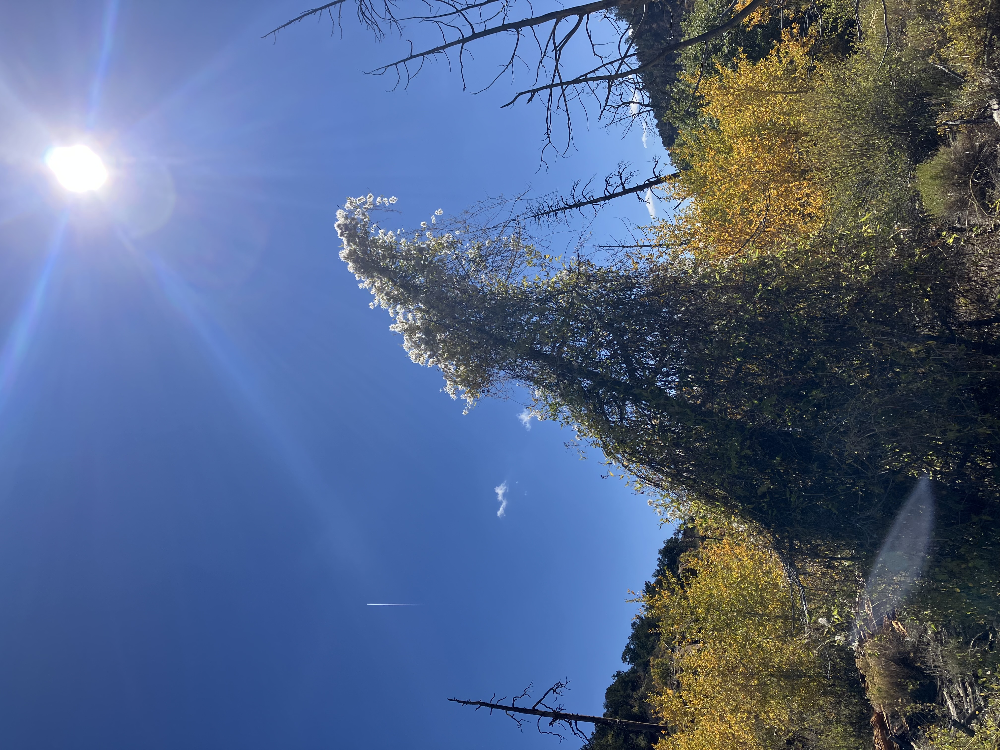
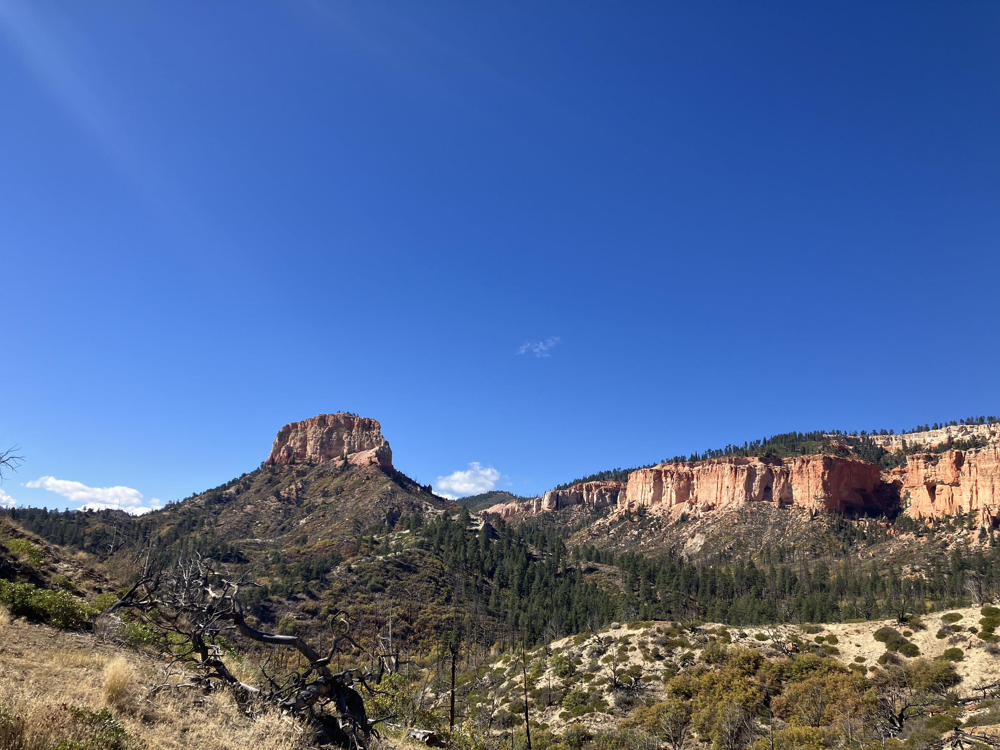
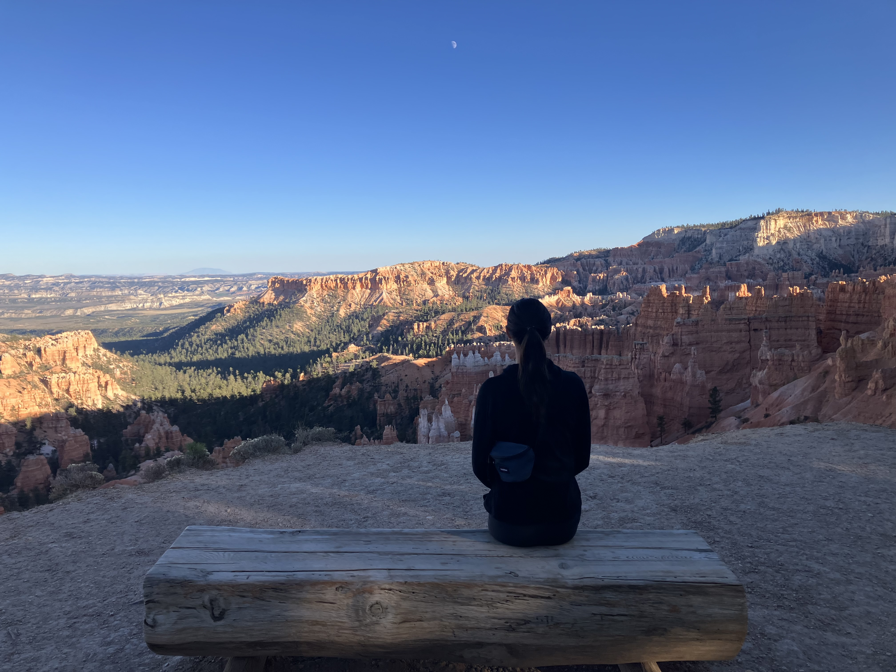

Wednesday, October 1st, 2025

Last full day of the road trip! Kurt and I checked out Swamp Canyon. It was much less touristy, I actually didn't run into a single person the whole loop. It was beautiful.

There were these interesting bushes made of vines around dead trees.

This one was especially wild.

In a valley towards the end of the hike, a blaze of young Aspens all turning yellow.

Later, took Kurt to the most touristy area to take a peek.

Kurty being a gremlin.

Unfortunately I didn't get any pictures from our last day, it was a bit of a whirlwind getting into SLC and having dinner for Kurt's Mom's birthday. But we basically pushed off and got some milk from a grocery store and had some O's in a wash and then drove in! We were so stinky it was crazy.
