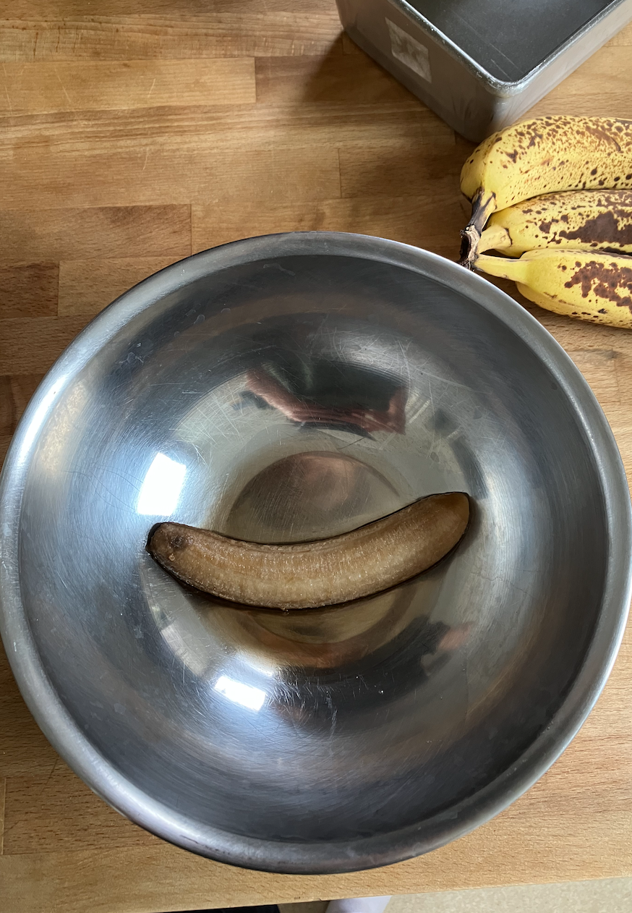

Second weekend in the new Dogpatch location at breadbelly. When I go to park my bike outside the restraunt, I look out at the water. This morning there was some cool light coming in from the clouds and illuminating the water in a nice way.

When I got home I made banana bread. I used this recipe from the NYT:
- ¼ pound butter (1 stick): 113 g (plus extra for greasing the pan)
- ¾ cup dark brown sugar: 150 g
- 2 eggs
- 2⅓ cups very ripe bananas (about 5): 550–600 g mashed bananas
- 2 cups all-purpose flour: 240 g
- 1 teaspoon baking soda
- ¼ teaspoon salt
- little bit of olive oil
- some vanilla extract
- cinnamon
- chopped walnuts

I combined the bananas and eggs like Sohla suggests to break down the starches.

During this stage trying to whip this together the butter and sugar went flying everywhere.

Sadly I did not get a picture of the final product!! Don't worry, there's a picture of it on a later date. I'll get better at documenting recipes.
One thought I had is its kind of a bummer to be pulling out the phone to take pictures. In some ways its nice because you usually have your phone on you, but its also a conduit to all of these other notifications and things that I don't really want to be open. Maybe I'll start trying to use my other camera.