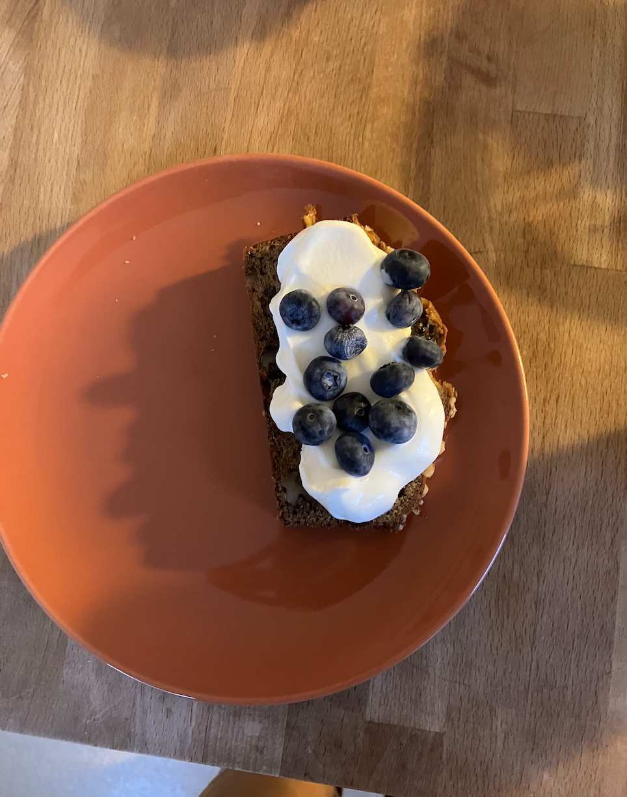

Okay here's a picture of the final product of the banana bread (kinda). I have to eat something before going into work at Breadbelly or else I'll go insane.

I wish I could take more pictures without feeling weird at Breadbelly, becuase there's so much I would try to capture. All of the huge ovens, the pastry chefs piping and shaping, staff meal. The walk-in. The huge equipment: huge wisks, huge spatulas, huge bowls. The vat of pastry cream. 
But I did take a picture (at my co-workers suggestion) of this latte I made. She was teaching me how to do latte art and this is one I actually felt proud of :)

After work Kurt and I went to dolo and threw the frisbee and then laid down a bit. Not too many dogs today. It's nice to see people out and enjoying summer even if its couldy and 63 degrees in July.