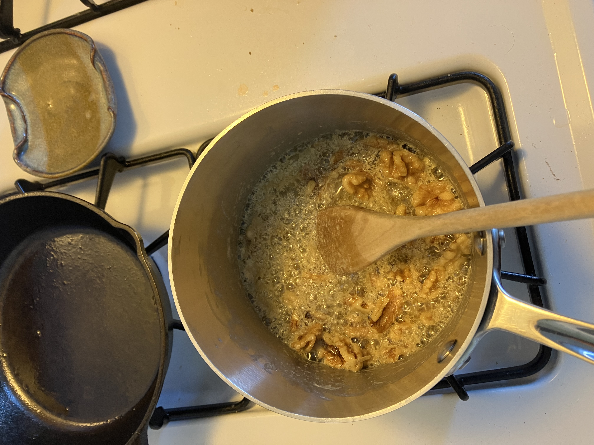

Monday, July 28th, 2025
Kurt and I went to do laundry and get coffee.
This bougainvillea in the park next to the laundromat is so beautiful right now.

Later we went on a run in ggp and took some paths we hadn't taken before. We went through the rose garden.

This chestnut tree looked so lush, everything was green and the sun was out. Incredible day at ggp!      

I made cookies later in the day for some friends coming over later. 
This is the second time I've made Sohla's browned butter walnut cookies. This recipe is so good and easy, especially if you have a scale. 

The one thing I remember from last time was to cut the walnuts into smaller pieces than you think, becuase the cookies themselves (30 grams) are relatively small. 

I forgot to take pics of the cookies because the friends were over, but I'll take a picture later I promise!!