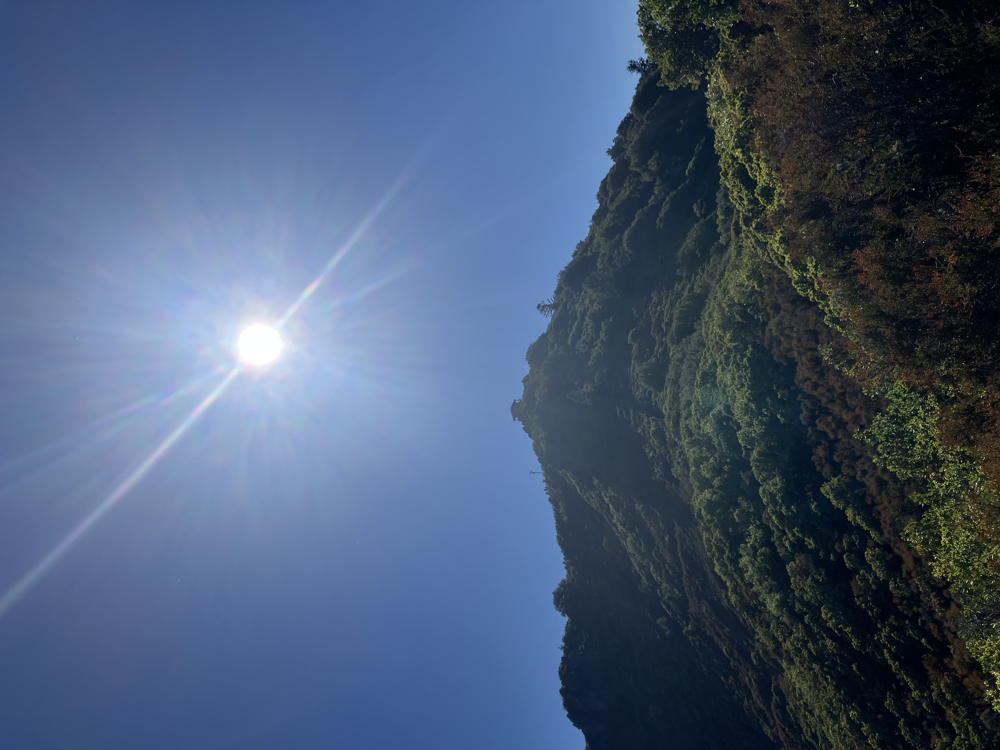
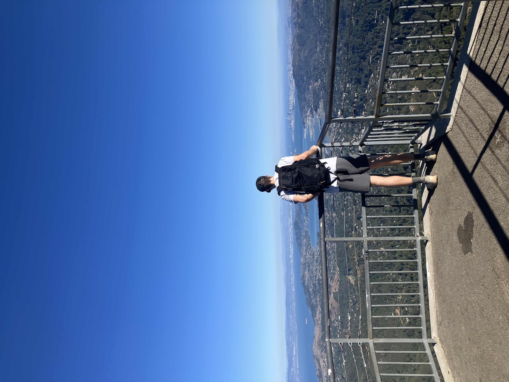

Tuesday, August 19th, 2025

On our way to visit Nana, Bess, Cole, and Elsa. We stopped at Sol food. The food was good, but we were
feeling a bit hot and uncomfortable I think.

Hiking up mount Tamalpais later after our visit. Cole gave us a route that takes you straight up the mountain
so you can "speed run" it. Its basically a service trail for the pipes that run up and down the mountain, which yes 
goes straight up and also gets a little scrambly at points. But Kurt and I worked our way up and wondered "have we been living the easy life".

After circumnavigating the peak we took a much more chill way down which took a long time but was very enjoyable. 
