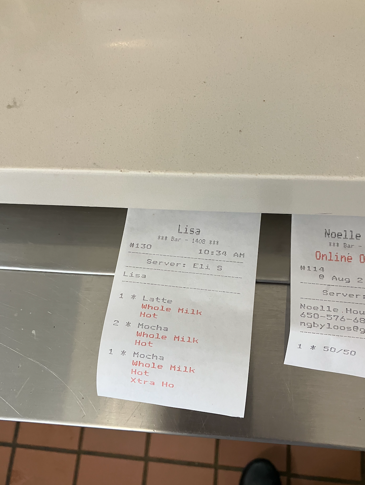
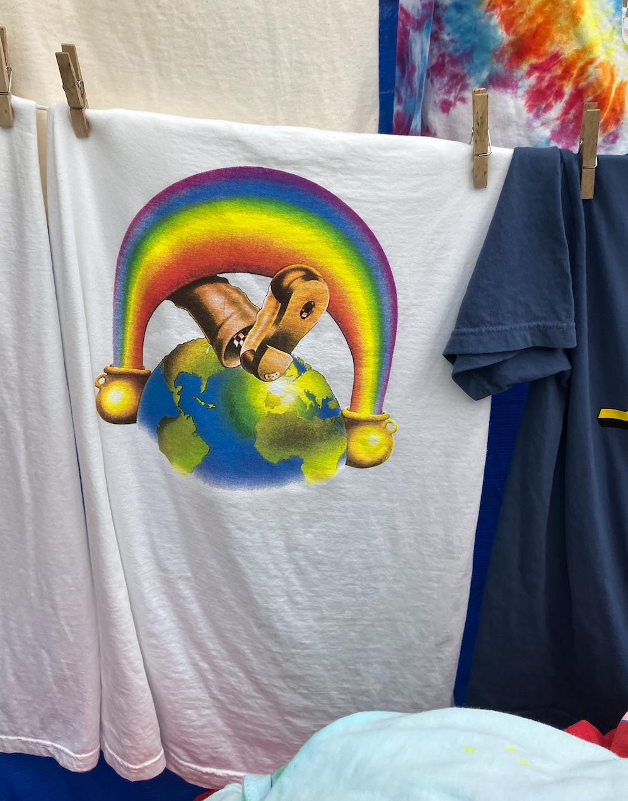

Saturday, August 2nd, 2025
This day at Breadbelly 1408 was crazy. We were down a person in the front and a person in the back, and it was the Grateful Dead show. Still though, it was kind of fun. I enjoyed this ticket from Eli asking for a mocha Xtra ho.

After work, I met Kurt and Annais at the Shakedown Street, which was a street of vendors that historically followed the Grateful Dead around when they were touring. Now it was a sanctioned vendor area for the 60th anniversary at Golden Gate Park. I was super curious about the scene and wanted to check it out. Clem agreed to pay for my t-shirt and his t-shirt if I got them. The two I have pictured here are not what I ended up getting, but I really enjoyed these.

