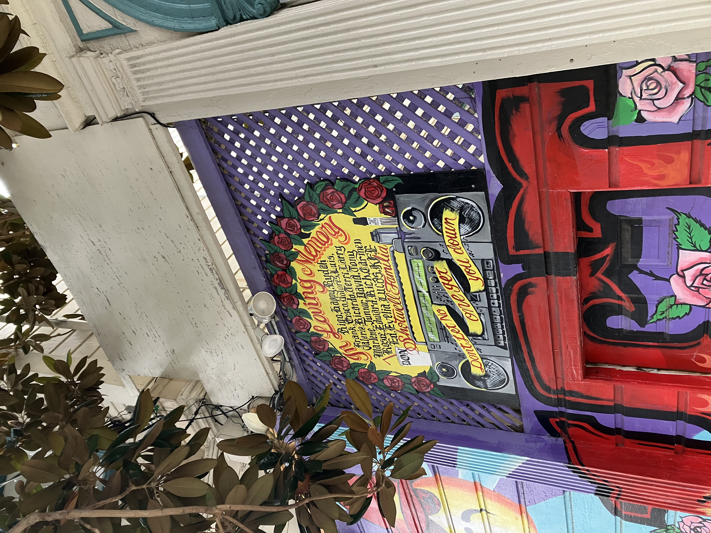

Monday, August 25th, 2025

On my walk back from my morning workout I saw this mural, I liked the lettering over the boombox. "Don't let no one get you down".

Later, Kurt and I went on a walk to Glen Canyon. We were going to throw the frisbee, but the fields were all taken up by little leuge, golf camp etc.

So instead he showed me this community garden near the park. It had a bee hive:

I liked this swiss chard, because the garden is on a hill you can be on the level of the plants.

Poppies poppin off.
