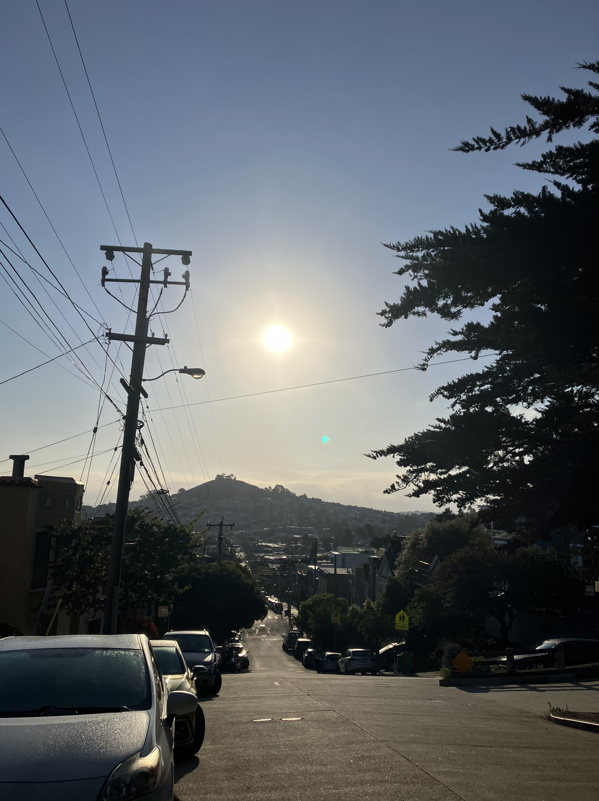
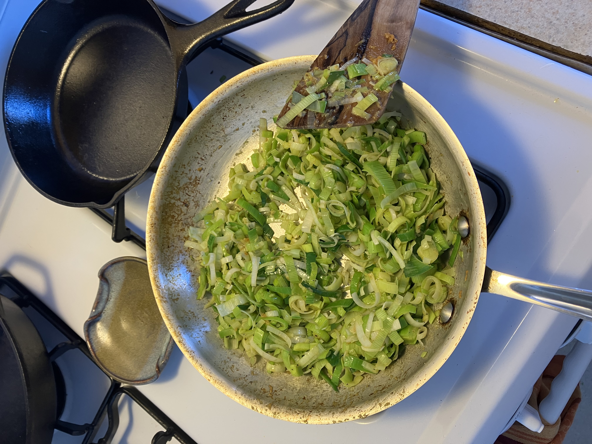
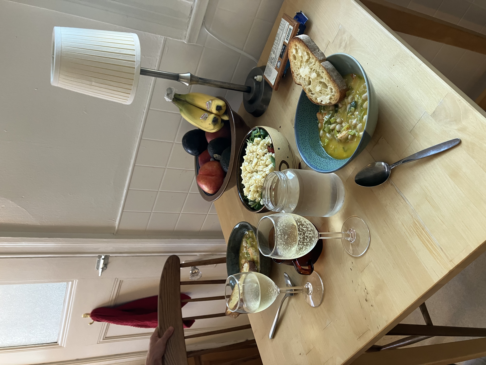

Wednesday, August 27th, 2025

Went on a run up to billy goat hill this morning, this is the view before hitting the park. It feels unusual for it to be so bright and clear in the mornings recently, when usually its foggy or cloudy. The mornings have been so nice.

Kurt released his Quaternions YouTube video today. Woohoo congrats Kurt! As a celebration I made him dinner at home. It was garlic shrimp and leeks and beans. I also made a salad with corn. It turned out well! 3 dollars and change for half a pound of shrimp from the Seafood store on Mission, we are spoiled. 

We also opened a tiny bottle of proseco from the case that Kurt got a while ago from Costco :)
