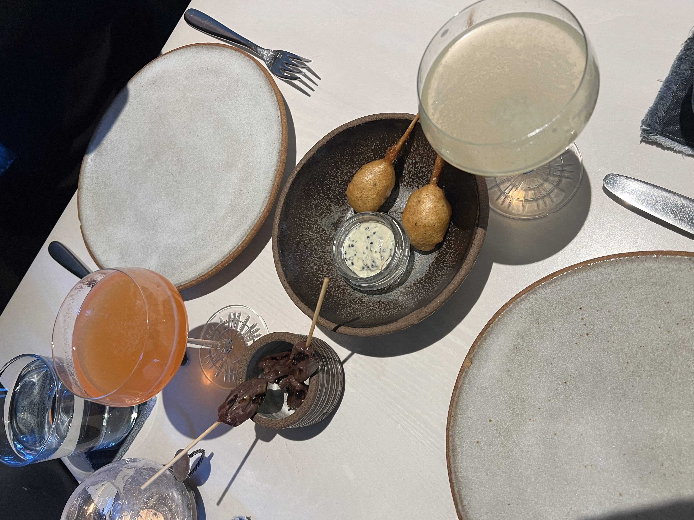
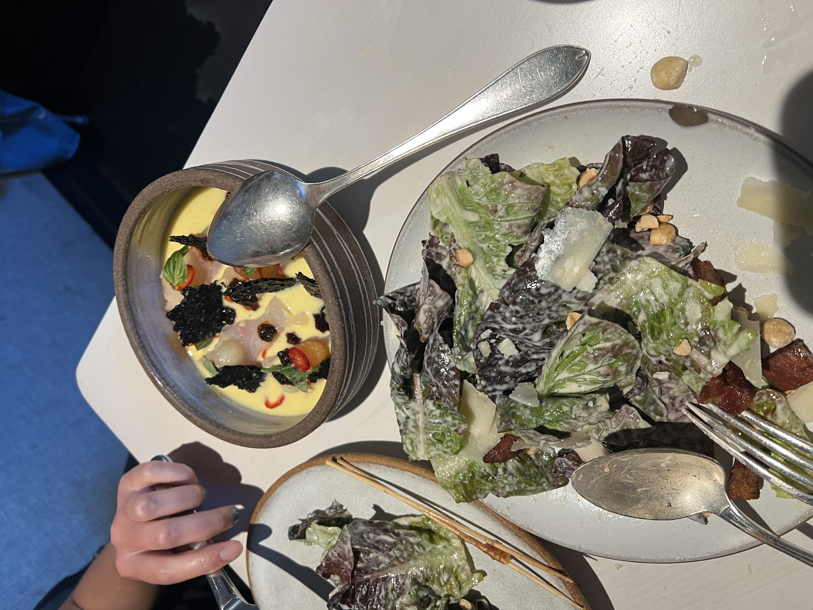
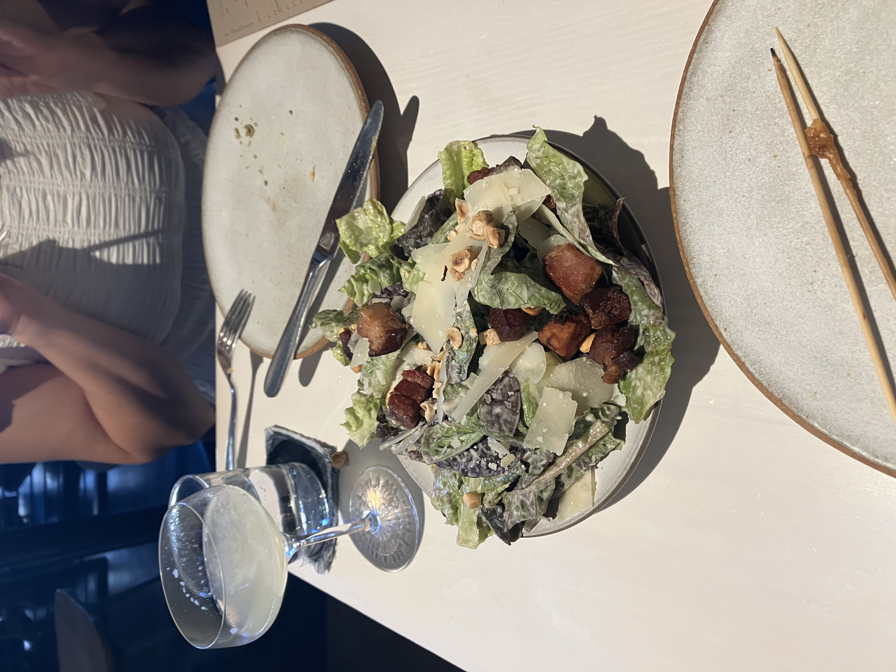
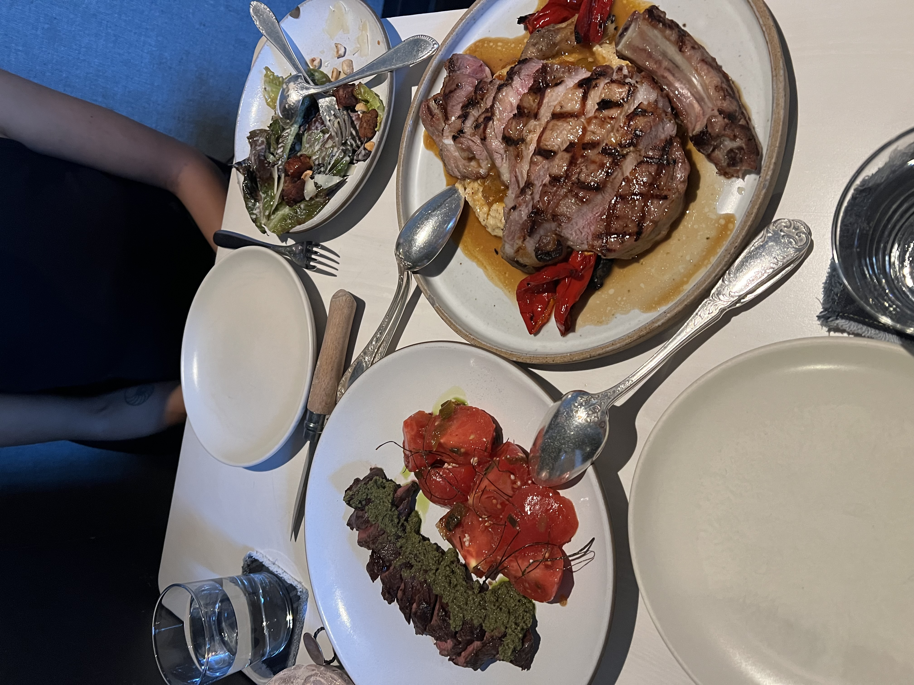
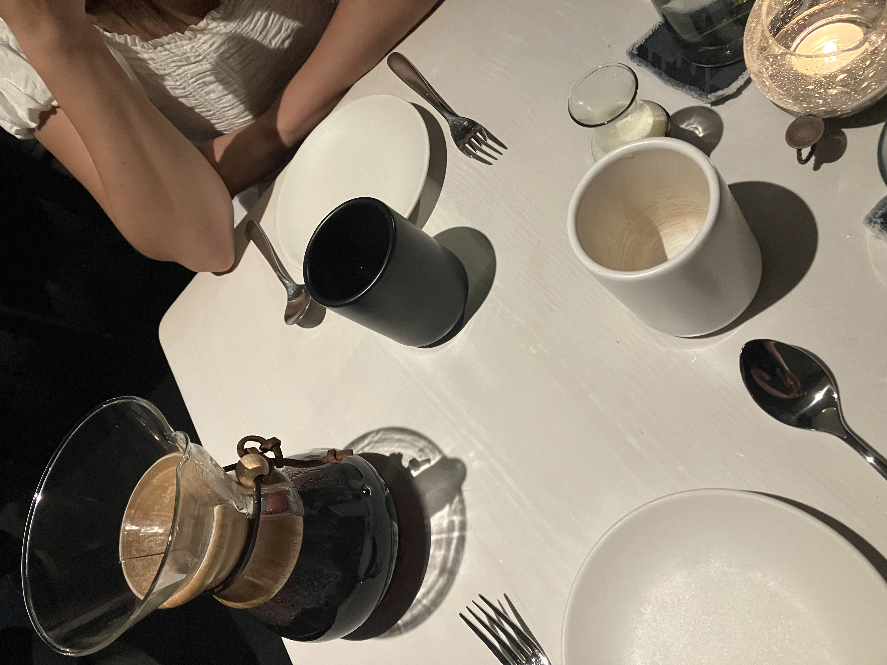

Thursday, August 28th, 2025

Today Lana and I went to the Morris and it was sooooooo good and so fun to chat and hangout with Lana. 

The Morris is relatively close, so I could definetly walk next time from the apartment. It's very good but also not super hyped right now on socials or anything- so getting a reservation wouldn't be crazy and also you could probably just walk in. Although it did fill up on this Thursday.

Lana and I got some v tasty cocktails and some chicken nuggets with caviar ranch, duck hearts, and mushroom profiterols to start. My favorite of this round was the nuggets.

Next we got a little gems salad and crudo. Both incredibly good.

Main course was steak and pork chop. The pork was so good, definetly the best pork I've ever had. It was seasoned and cooked really well, fairly simple. Then there was polenta and peppers which went so well with it.

We ended with (not pictured) donuts and decaf drip coffee in a chemex with Fellow mugs which were both so good again. I sound like a broken record but these guys are really onto something- the service and experience is so lovely. Lana and I went to Sirene first in Oakland and I liked it so much I did some research and found out that the same owners first restaurant is the Morris. Anyways I just think it's super solid and it was such a good experience. 

