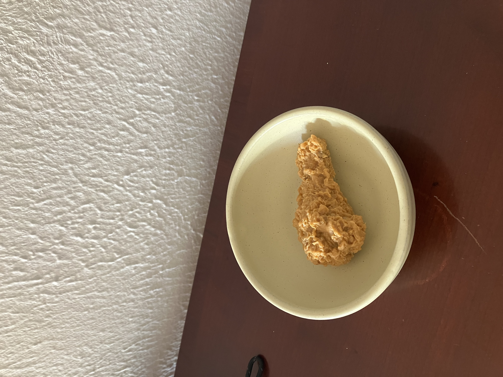
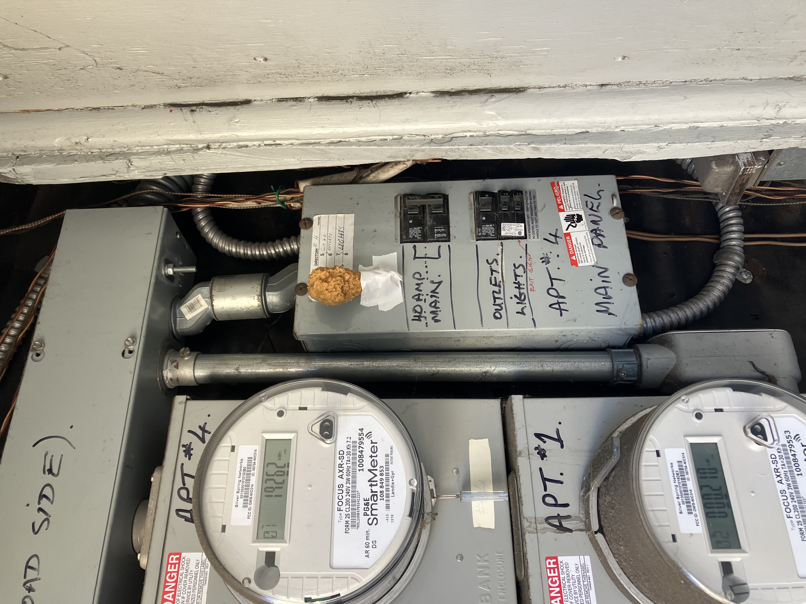
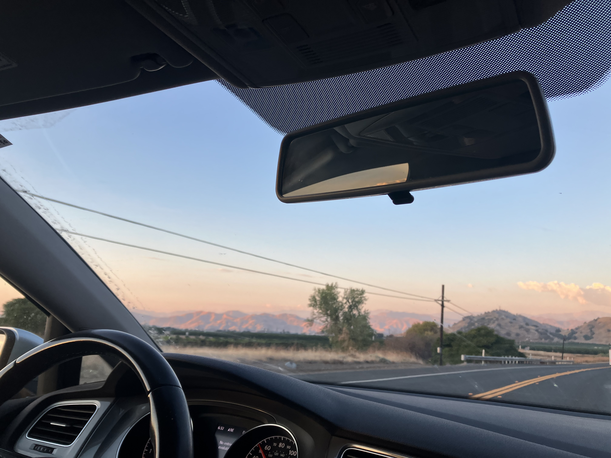
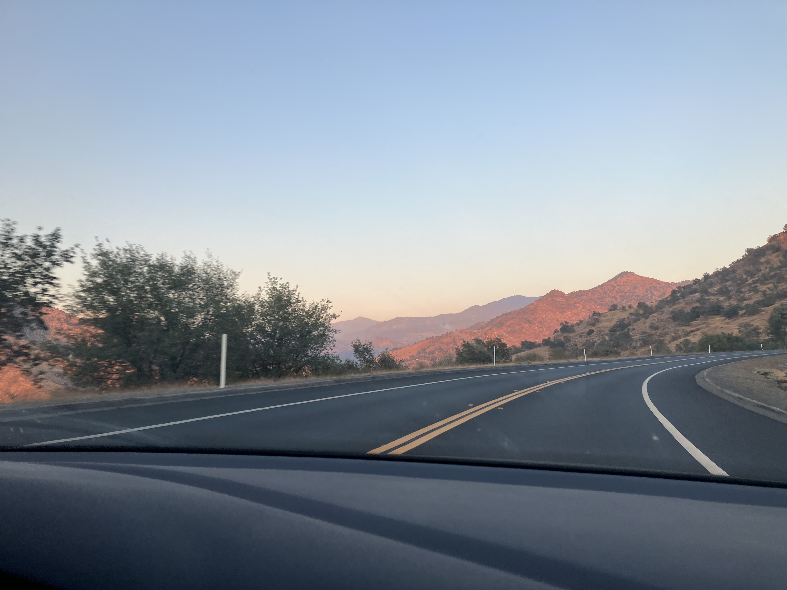

Tuesday, September 23rd, 2025

First day of the Road Trip! Fake nugget from Clem in my bowl I made at Sven Ceramics.

Nugget ready to be picked up.

Driving into Sequoia National Park. I was starting to come down with whatever illness we both got on this day. It was also a bit of a time leaving the apartment, and I was sneezing the whole car ride and hoping I wasn't getting sick. 

Our campsite was at the end of a 1+ hr long windy road, with 2 miles of gravel at the end and construction for 13 miles. It was kind of a blessing in disguise though because we wouldn't have been able to get past before 4 pm, and had to be escorted until 7pm because of the road work. It was beautiful during the sunset, and then most of the drive we did after dark. The stars were crazy.

