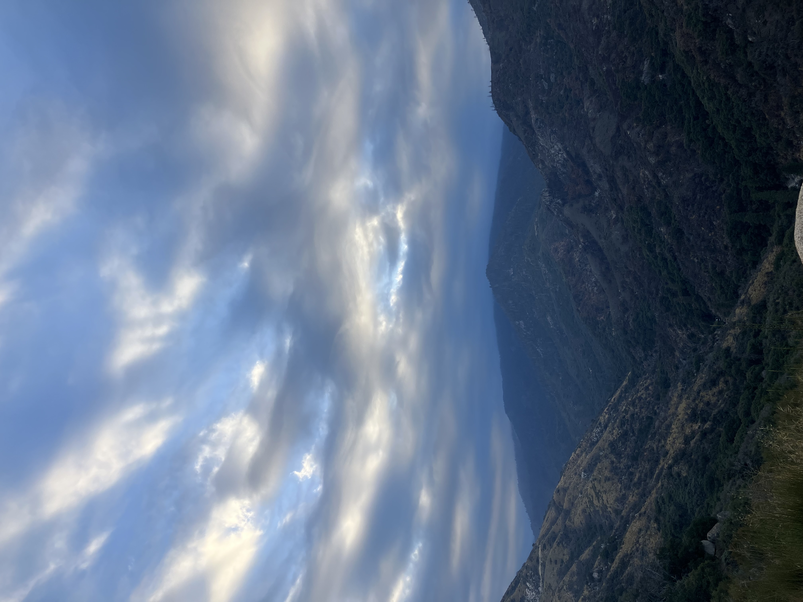
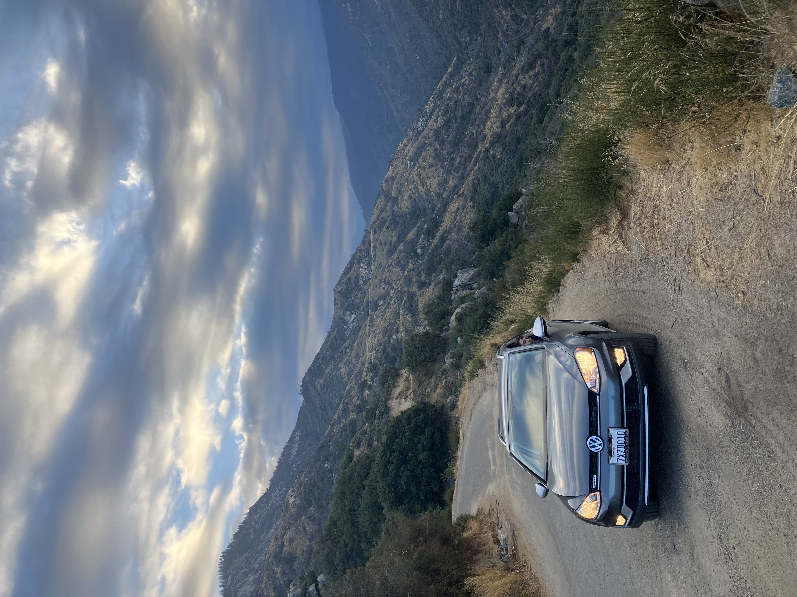
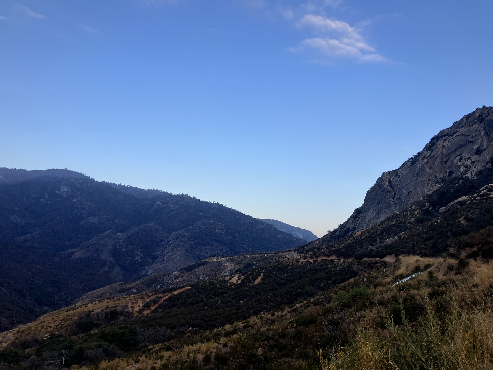
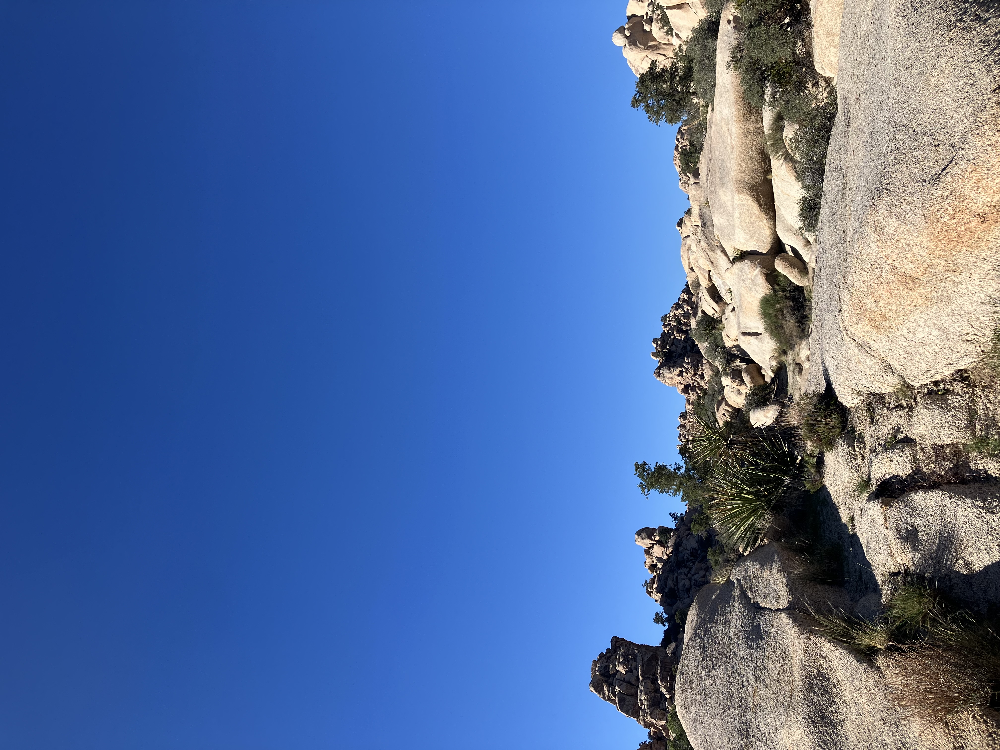
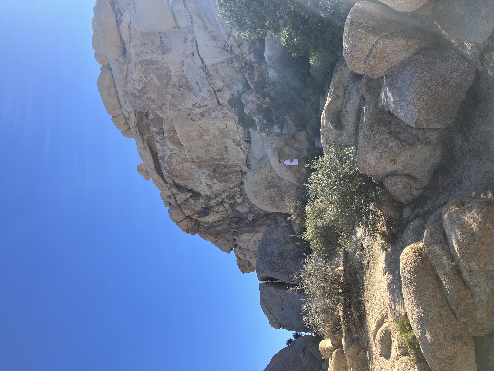

Thursday, September 25th, 2025

Day three of the road trip we pushed off very early and got to see the sunrise as we drove down the very windy road. Construction was just starting but we didn't have too much trouble.

Kurt pulled off at this stop that was very beautiful.

We made it to Joshua tree in good time after lunch at the Carls Jr and a stop at grocery outlet. We were able to snag a campsite at Hidden Valley with a big rock and a lovely backyard with climbers often snaking through. I was immediately very charmed by all of the little plants. I liked this cactus.

View from our backyard.

Kurty exploring.

We took it mostly easy this day and took a small hike around our backyard. I was definetly feeling sick and ready to feel better after the car ride. We saw the Joshua tree stars and turned in.
