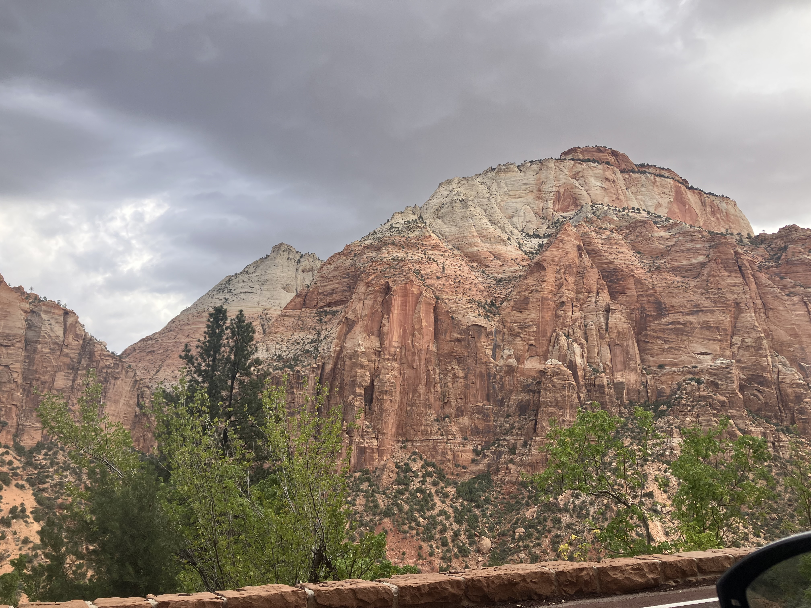
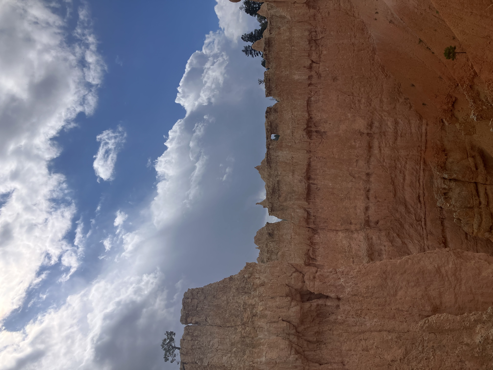
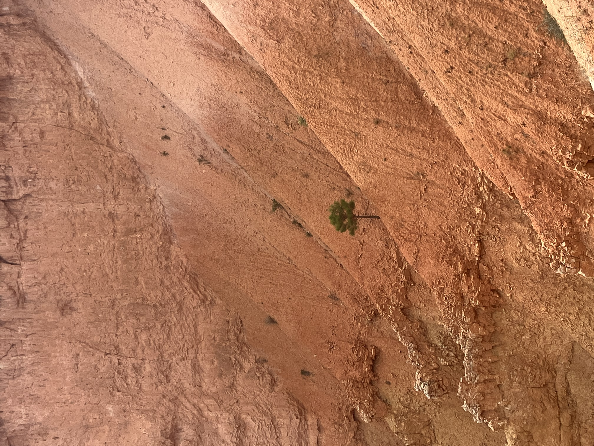
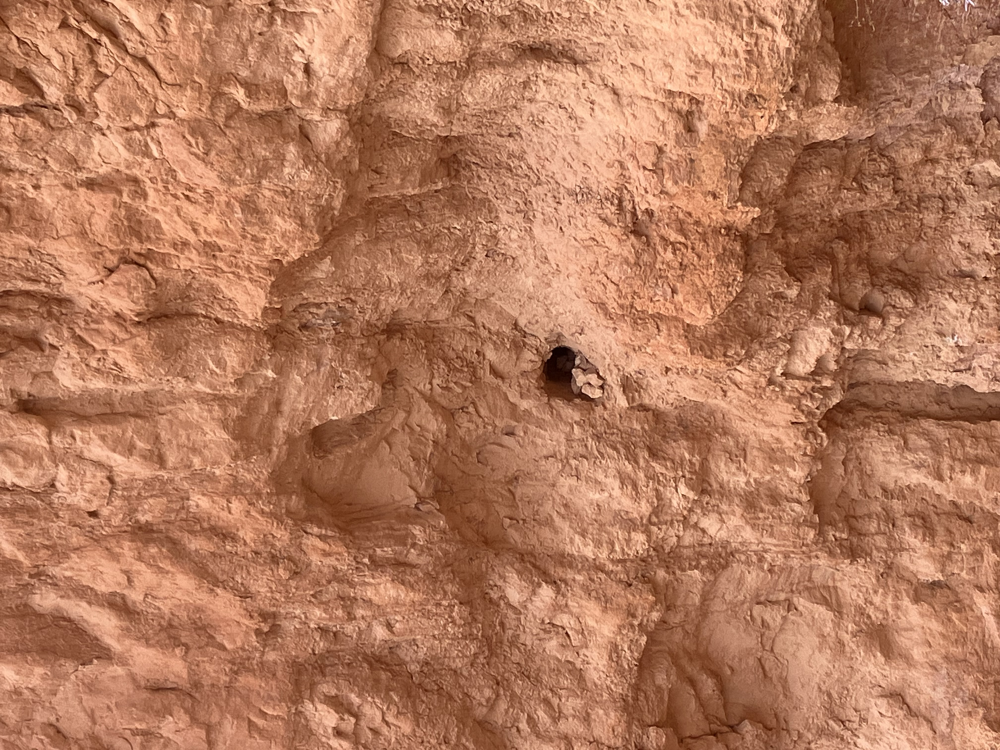
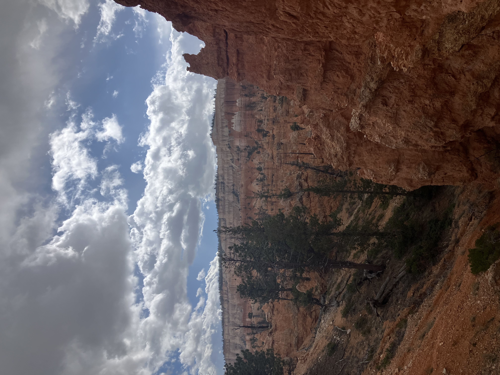
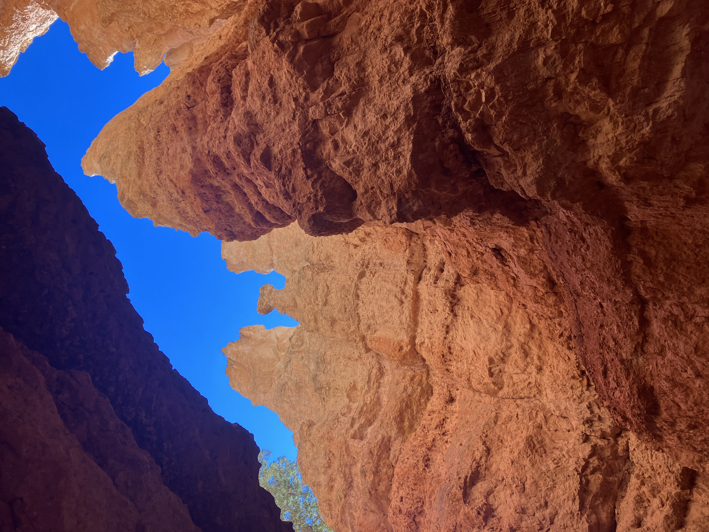
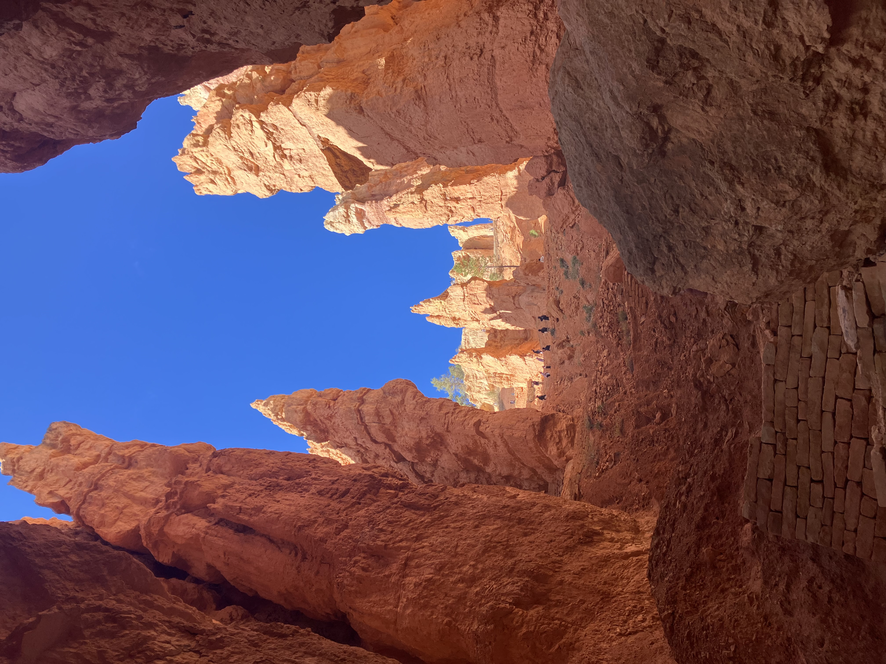
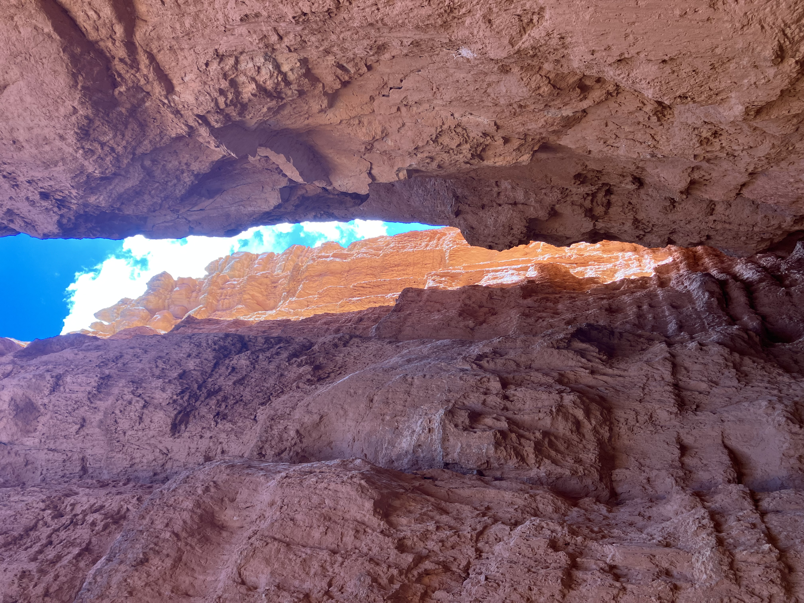

Tuesday, September 30th, 2025

This morning we got up in our BLM campsite and started driving through Zion. It was very cool but extremely crowded. Probably the coolest part I thought was stopping at a little canyon to pee and exploring a bit around the slot canyon.

We made it to our campstie in Bryce. I parked Kurt in the text becuase he was a sicky boy and went on a hike filled with many tourists.

Tiny tree!

I liked this little cluster of rocks at the opening of a hole.

This part of the hike is called "Wall Street". Very dramatic.

