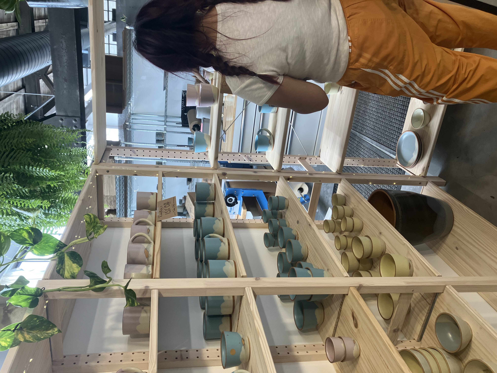
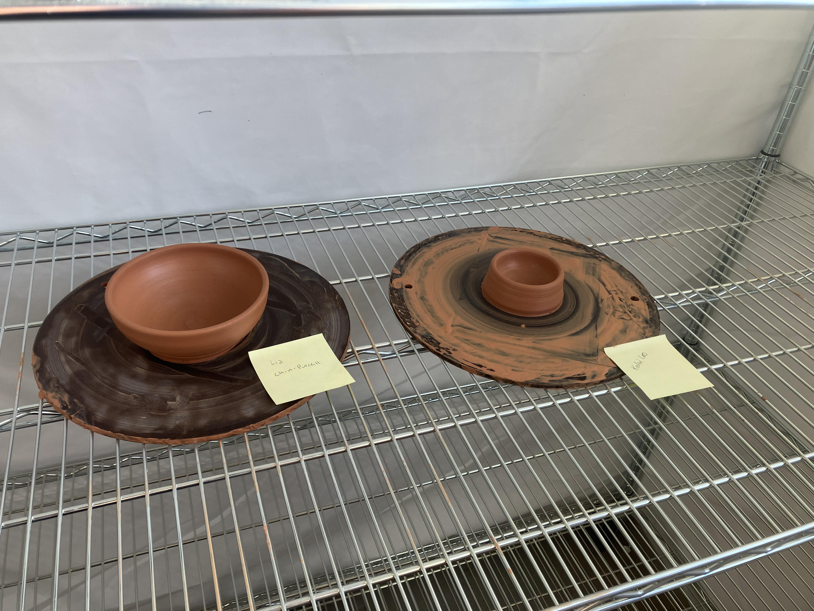
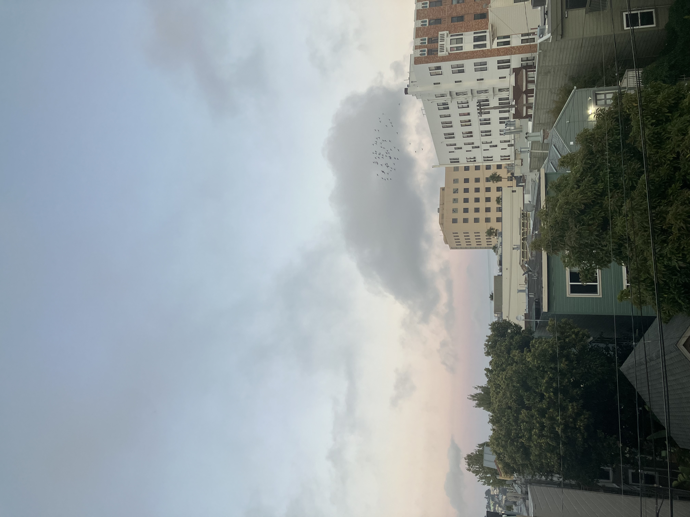

Saturday, September 6th, 2025

After work at Breadbelly today Kelsi and I were walking out to get a beer at Standard Deviant, and ran into Sven from SVEN Ceramics adjusting his sign out front. Today was his open studio, and we stopped by after the beer. I like the shapes of the pieces!

They offered to let us throw a pot! It was actually so nice and felt like a sign from a higher up to get back into ceramics. Kelsi and I's pots next to each other!

That evening, the swallows (pigeons??) back at it.

