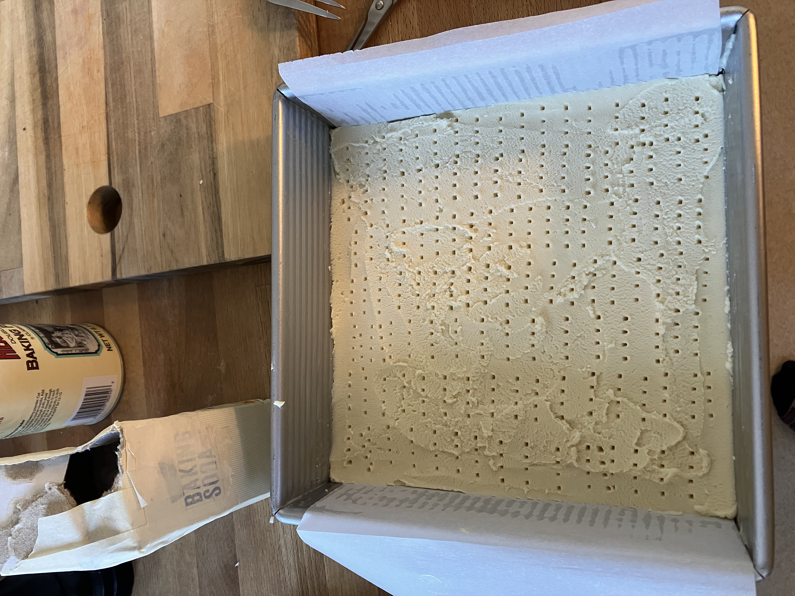
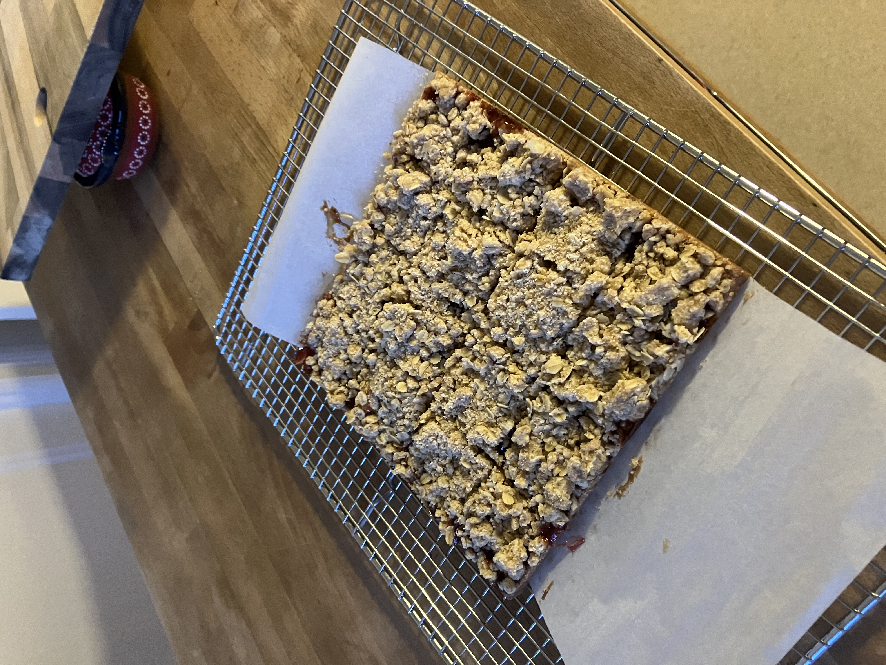

Monday, August 18th, 2025
Around noon we got sandwiches from Rhea's deli and went to dolores with Nat and Claire. The deli was great, I'm surprised we 
haven't tried it yet. They had a bunch of options, and I got the valencia st.

Later, I made shortbread cookies from Sohla's cookbook to bring to Nana's the next day. The recipe was very easy and I thought
they turned out well, just a bit sweet. Luckily there are a lot of mods and different options you can do, I think next 
time I might cut back on the crumble and also use a more sour or bitter filling.
Even better on day 2!

Its been stupid beautiful in the city recently, our summer is finally here. I watched the swallows flying around
together from the back deck for a little bit.

Shortbread cookies final product.

