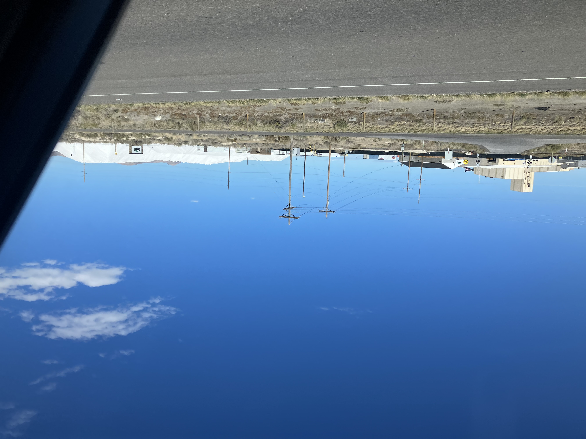

Sunday, October 12th, 2025

Today we started the road trip back home to San Francisco. Definetly more bittersweet than I was expecting, I was oddly sad to leave Salt Lake City. We drove past the lake, the first time I think for me. I was just talking to my sister about how I have never really gone and seen the Great Salt Lake up close, Kurt always says it's stinky. I would like to go check it out up close though, maybe go hiking on antelope island. 

As we were driving I was enamored by the huge piles of salt at the Mortons factory. For some reason I assumed the salt in the Great Salt Lake would be toxic or something, probably because I've mostly just heard about the heavy metals hanging out at the bottom of the lake ready to be swept up by the wind when it all evaporates. I thought it was kind of miraculous that people are actually collecting the salt out here. It's probably very obvious to people from here.

Sadly I didn't get any other pictures from today. We realized at some point that there was a huge snow storm headed our way and we did not want to be caught in it on donner pass so we pushed on later into the night. We stopped in Winnemuca instead of the Ruby mountains, we will have to visit the Ruby's some other time. In Winnemuca we got Korean food then camped in BLM land suprisingly close to the suburbs. Unfortunately during dinner I overheard someone talking about a murder so I was scared shitless. Also suburbia scares and also arriving at night. So I was in for a doomed night of sleep.