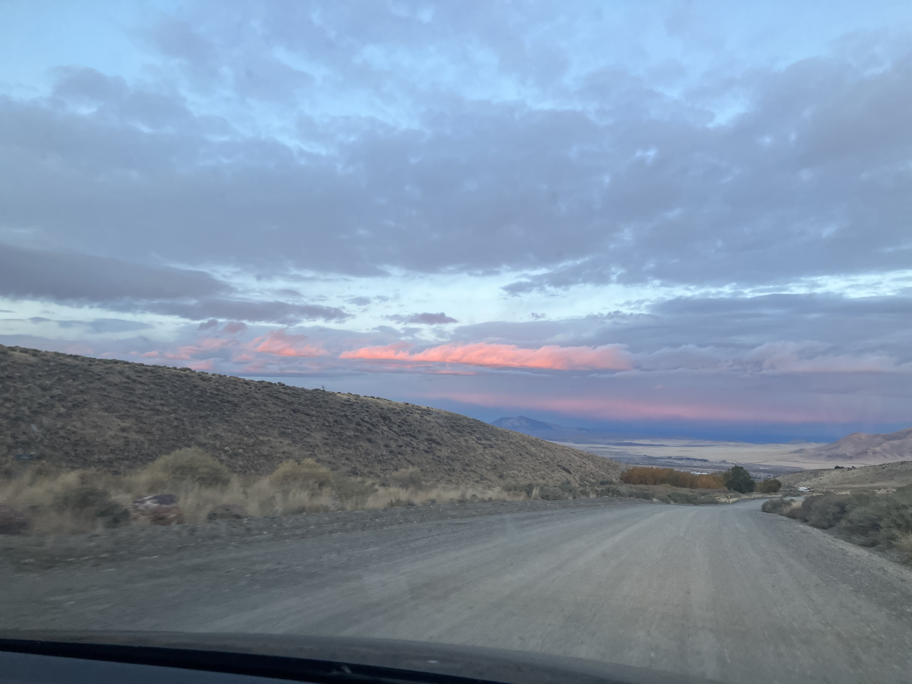
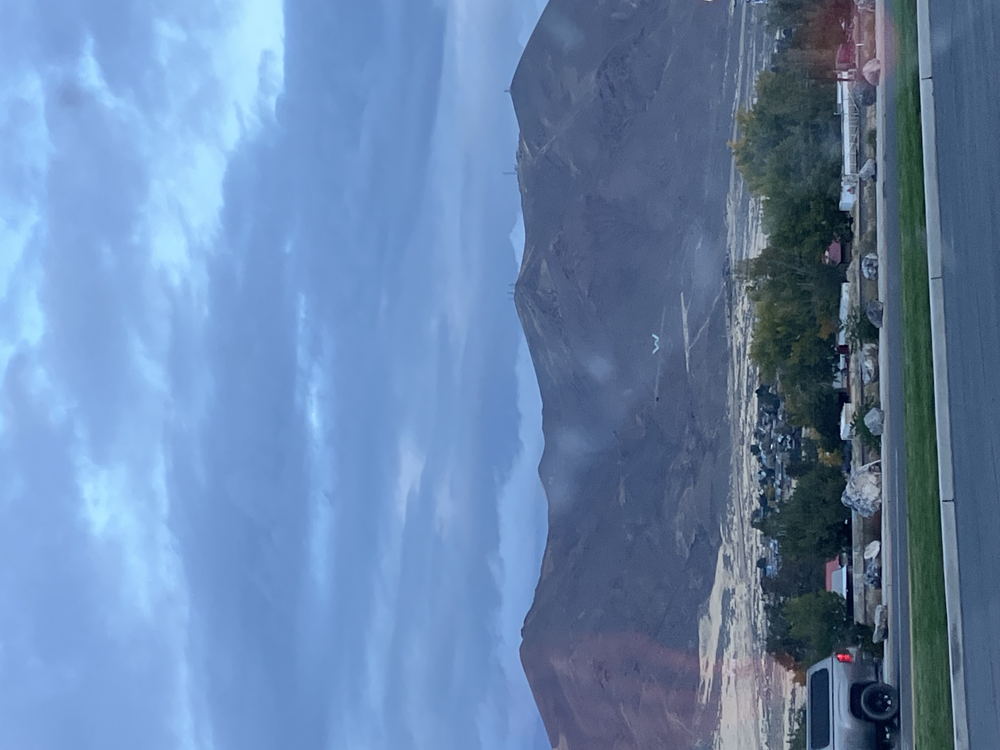

Monday, October 13th, 2025

Second day of the road trip home to SF, final stretch today! We woke up early after (for me) a fitfull night of sleep convinced a murderer was right outside our tent until I was too exaughsted to stay up. It's okay though becase Kurt told me I could be a passenger princess this morning. We're up and at 'em today with a medium cup of Maverick's decaf coffee!! The sunrise was hitting the clouds in a beautiful way this morning.

"W" for Winnemuca. See ya next time! 

I didn't get anymore pictures today but we basically drove and stopped in Truckee for a fatefull egg sandwich (difficult to find some breakfast under $20, welcome back to California!!). Then we continued to drive home making it over the pass, then it started raining. We got into SF when it was drizzling and carried everything inside and we were cranky and there was so much stuff. Lisa's chili helped us out a lot. Then we continued to try to put things away and gave up at some point and went to bed and I slept so hard.