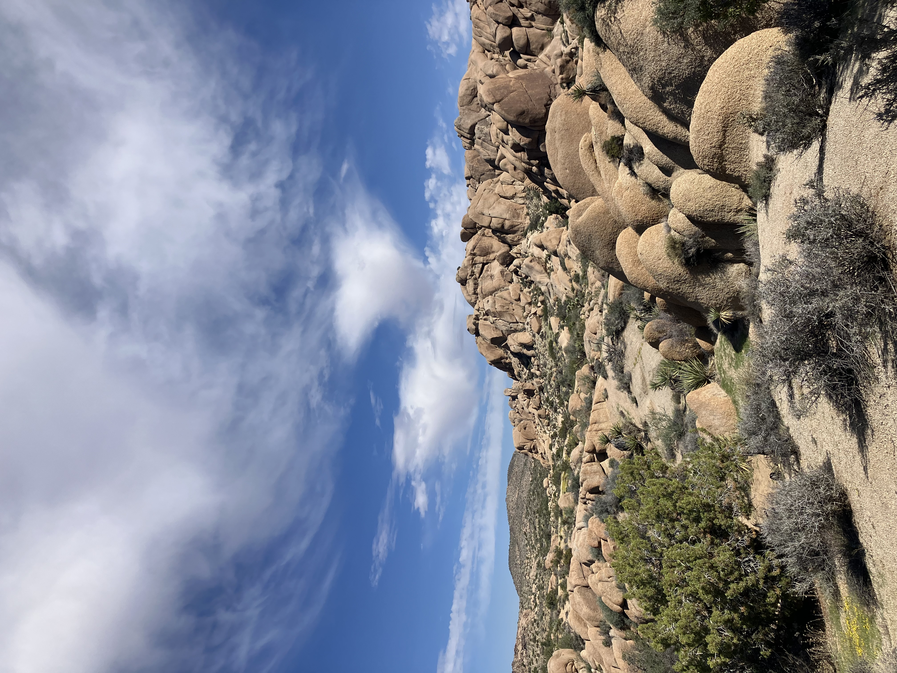
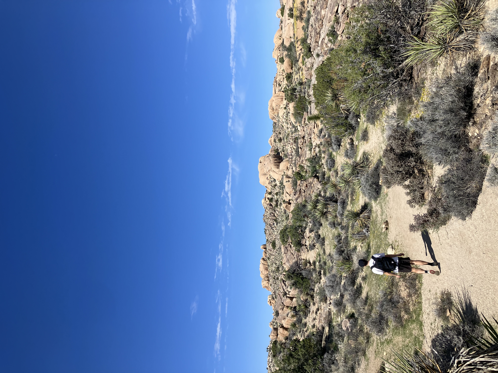
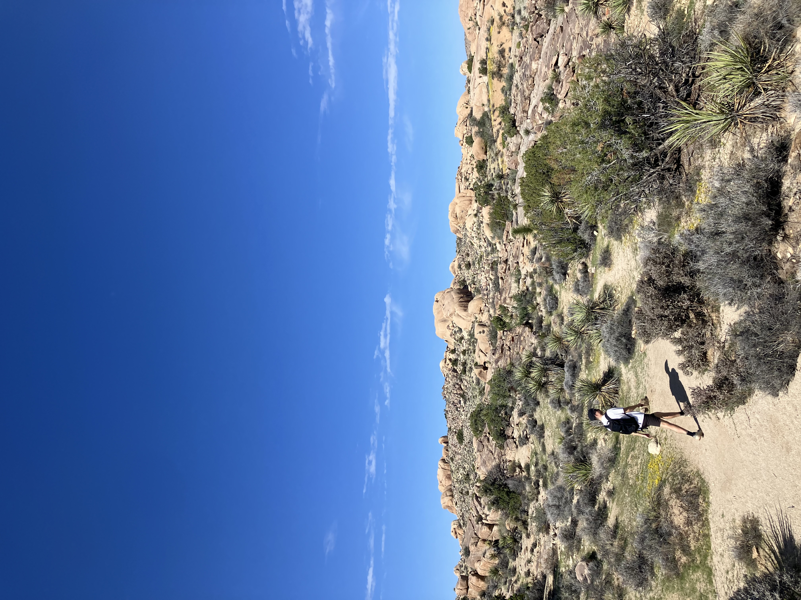
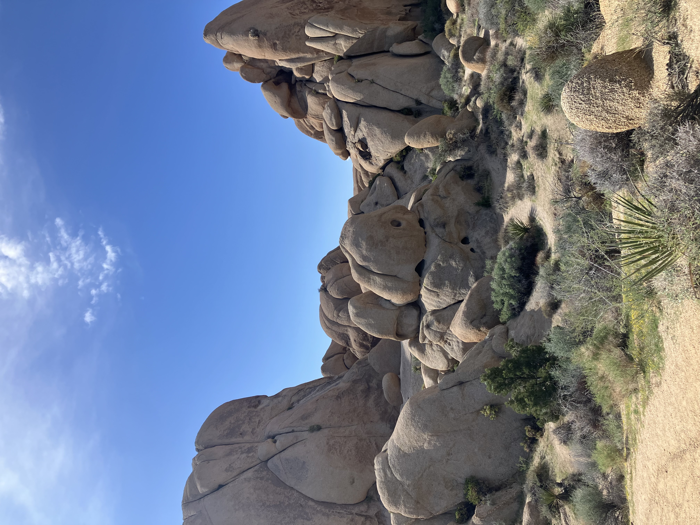
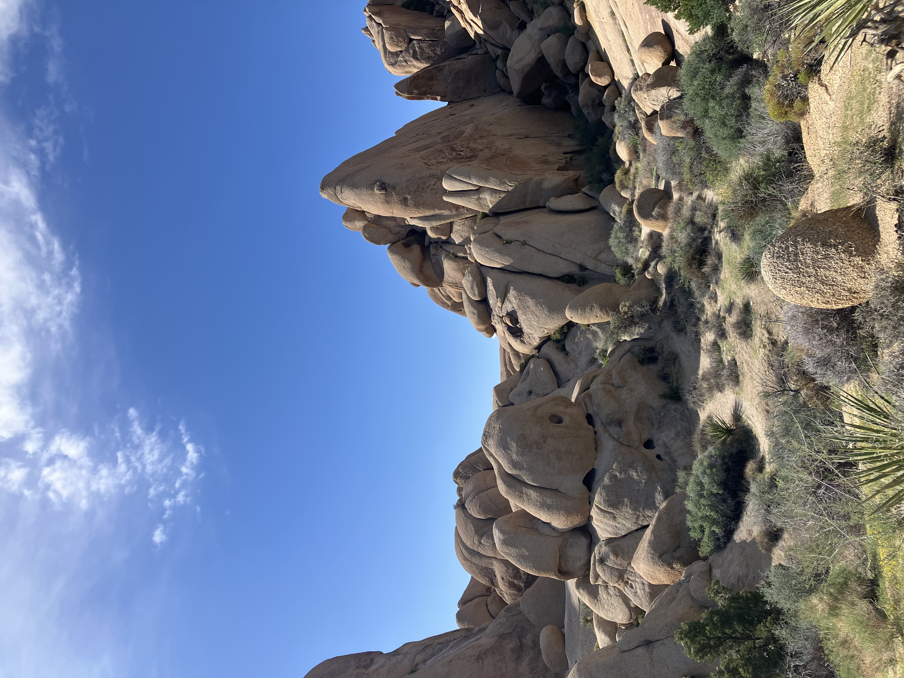
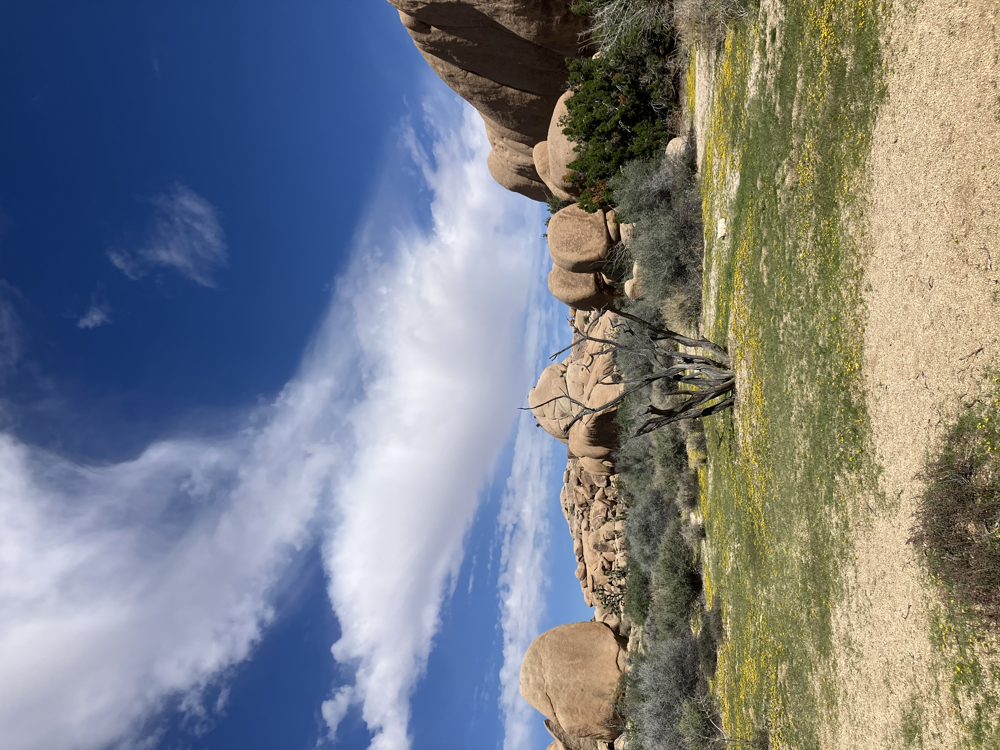
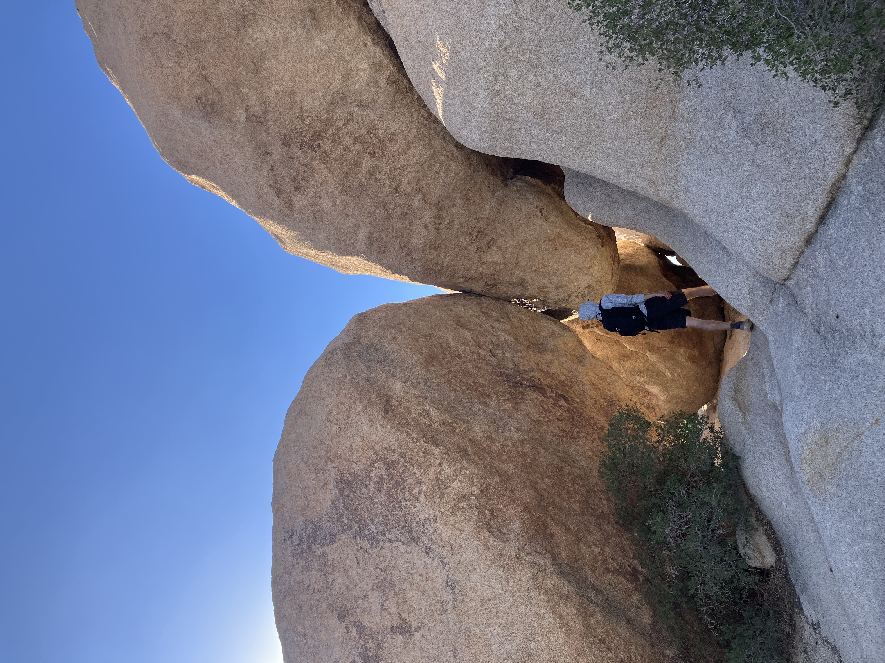
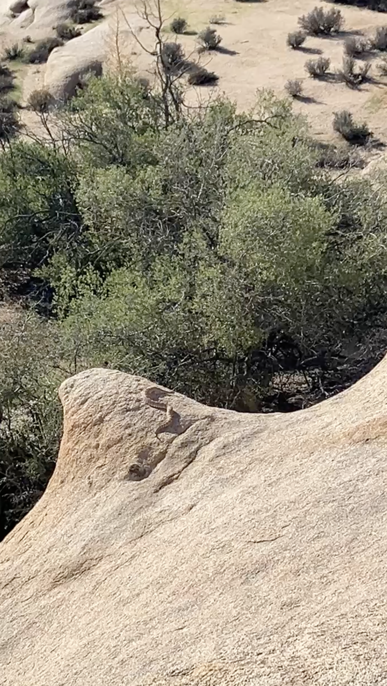

Friday, September 26th, 2025

I think I was starting to feel better this day after a good sleep. We decided to check out the Jumbo rocks area and a little nature hike overby there. It was getting toasty even early in the day. 

I liked this cool dead tree with nothing much around it.

The dead trees take a long time to decompose I think and get all dried out from the sun. Some of them were very twisty like this one.

Little protected area that was cool closer to our campsite.

We saw a big snake hanging out on this rock!!

