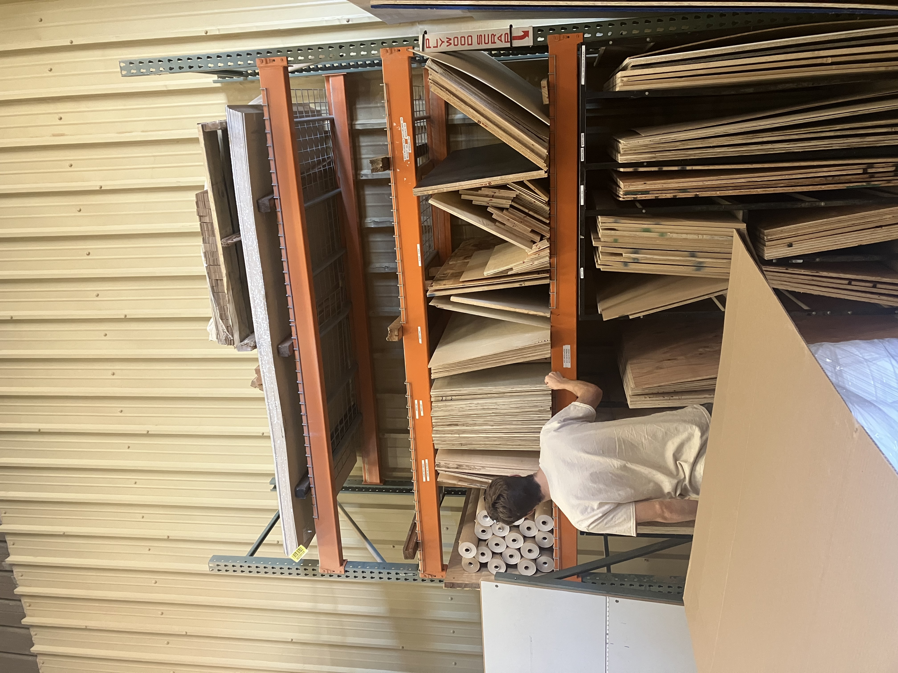
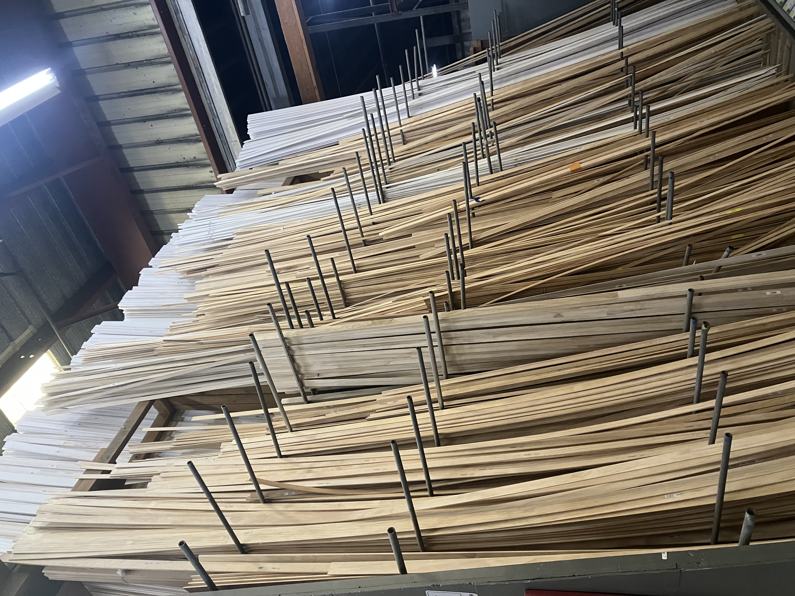
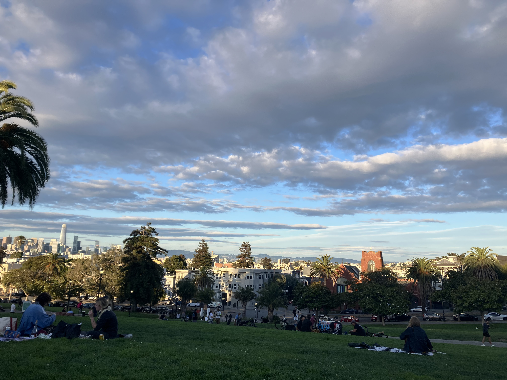

Monday, September 8th, 2025

Today Kurt and I went to Breadbelly for lunch on my off day and also trimmed the pots at Sven's ceramics. Our food was great and it was nice to see everyone and say hi. We went to the hardware store after so Kurt could buy materials for adding a shelf in one of our cabinets so we can fit more glasses in the cabinet. He had a cappucino at Breadbelly so he was all energized and I faded fast.

These pieces of wood are so tall. I'm reading Overstory so it made me think of all the trees these pieces of wood came from, and how they unravel the trees to make plywood. Its shocking how I've never really thought of plywood and how they make it until this moment.

Later we went to Dolores and enjoyed a beautiful sunset. The clouds and light were looking interesting.

